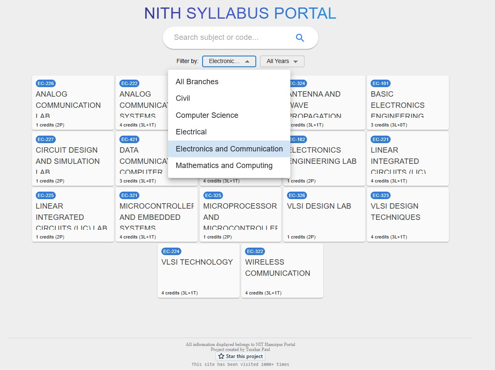
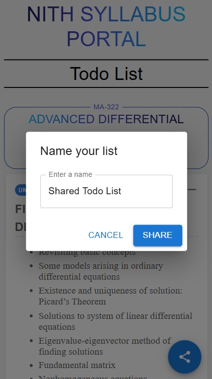

# 📘 NITH Syllabus Portal

The **NITH Syllabus Portal** is a web application that provides a clean and easy-to-navigate interface for accessing the academic syllabus of **NIT Hamirpur**. This tool eliminates the need to download and manage multiple PDFs, allowing users to easily view, search, and organize syllabus information. It’s designed to enhance students' productivity by adding features like to-do lists and sharing options.

## 📸 Screenshots

- **PC View**:
  

- **Mobile View**:
  

## 🎯 Features

Here’s an improved version with more detailed phrasing:

- **Instant Syllabus Access**: View the complete NIT Hamirpur syllabus online in an intuitive, organized format without the hassle of downloading PDFs or managing files.
- **Advanced Search & Filtering**: Quickly locate subjects by entering the name, subject code, branch, or year, giving you immediate access to relevant course details.
- **Custom To-Do Lists**: Organize your study tasks and syllabus highlights by creating personalized to-do lists, helping you stay on top of your academic goals.
- **Easily Shareable Lists**: Generate a unique link to your to-do list, making it simple to share study plans with classmates or friends for enhanced collaboration.
- **Collaborative Mid-Sem Exam Lists**: Prepare for semester exams by creating tailored syllabus lists, with options to share them with the entire class, making collaborative studying easier and more effective.

## 🚀 Getting Started

Follow these instructions to set up the project locally.

### Prerequisites

- **Node.js**: Ensure you have Node.js installed. You can download it from [here](https://nodejs.org/).

### Installation

1. **Clone the Repository**:

   ```bash
   git clone https://github.com/tpstark137/NITH-Syllabus-Portal
   cd NITH-Syllabus-Portal
   ```

2. **Install Dependencies**:

   ```bash
   npm install
   ```

3. **Start the Application**:
   ```bash
   npm start
   ```
   The application will be accessible at `http://localhost:3000`.

### Environment Variables

Create a `.env` file in the root directory and add any necessary environment variables as required for backend configuration (if applicable).

## 📋 Usage

### Viewing the Syllabus

- Open the homepage to see the full syllabus laid out in an easy-to-read format.

### Searching and Filtering

- Use the search bar to find subjects by their **name**, **subject-code**, **branch**, or **year**. The filter options allow you to narrow down the syllabus content quickly.

### To-Do List

- Add items to your to-do list to organize your study goals.
- Check off completed items to track your progress.

### Shareable Lists

- After creating a list, generate a unique link that you can share with others.
- Perfect for sharing mid-semester exam syllabi with classmates, ensuring everyone has the same study material.

## 📄 License

This project is licensed under the MIT License. See the [LICENSE](LICENSE) file for details.

---

## 🤝 Contributing

Contributions are welcome! Feel free to submit a pull request or open an issue to discuss new features or bug fixes.

---

Enjoy using the **NITH Syllabus Portal** to streamline your syllabus navigation and study planning!
